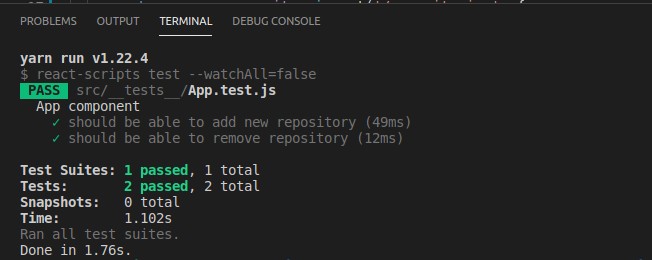

# reactjs-concepts
<h1>GoStack ReactJs Challenge 01</h1>

Nesse desafio, criei uma aplicação para treinar o que aprendi até agora no ReactJS!

Desenvolvendo uma aplicação que irá armazenar repositórios do seu portfólio, que você já desenvolvi o backend no último desafio utilizando o <a href="https://github.com/deal-machine/nodejs-concepts" target="_blank">Node.js</a>.

<h2>Funcionalidades da aplicação</h2>
<ul>
<li><b>Listar os repositórios da API</b> Lista com o campo title de todos os repositórios que estão cadastrados na API.</li>

<li><b>Adicionar um repositório a API</b> Adiciona um novo item na API através de um botão com o texto Adicionar e, após a criação, exibe o nome após o cadastro.</li>

<li><b>Remover um repositório da API</b> Para cada item da lista, possiu um botão com o texto Remover que, ao clicar, irá chamar uma função para remover esse item da lista do frontend e da API.</li>
</ul>

<h2>Os testes</h2>

<h3>Para esse desafio temos os seguintes testes:</h3>

<b>should be able to add new repository</b> Para que esse teste passe, sua aplicação deve permitir que um repositório seja adicionado ao seu backend e listado no seu frontend dentro de uma LI.

<b>should be able to remove repository</b> Para que esse teste passe, sua aplicação deve permitir que ao clicar no botão de remover que vai estar dentro da LI do repositório adicionado, o item seja removido da listagem.
